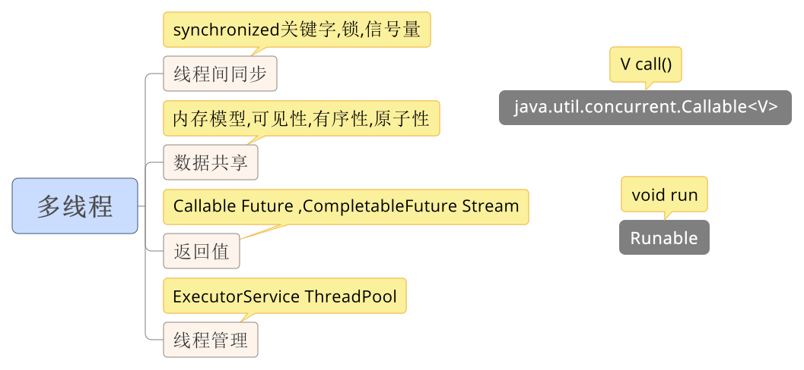

### __Java多线程__

### [线程状态详细](java_多线程_线程状态.md)

### **[线程中断问题](java_多线程_线程中断问题.md)**

### **[synchronized](java_多线程synchronized.md)**

### **[java内存模型](./java内存模型.md)**

### **[线程知识](java_多线程info.md)**

## [回到上一级](../index.md)

